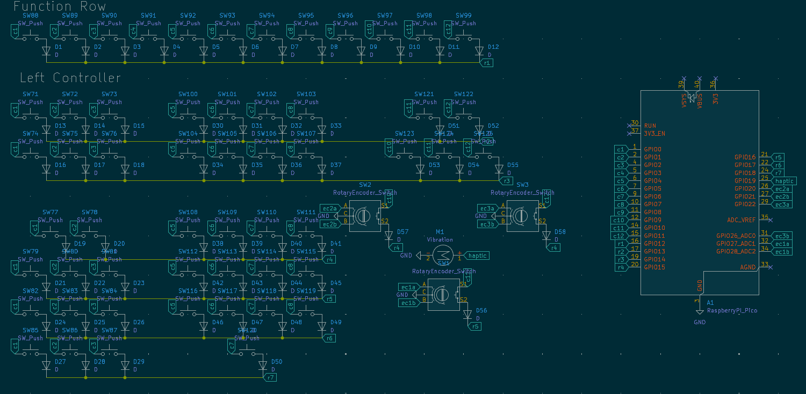
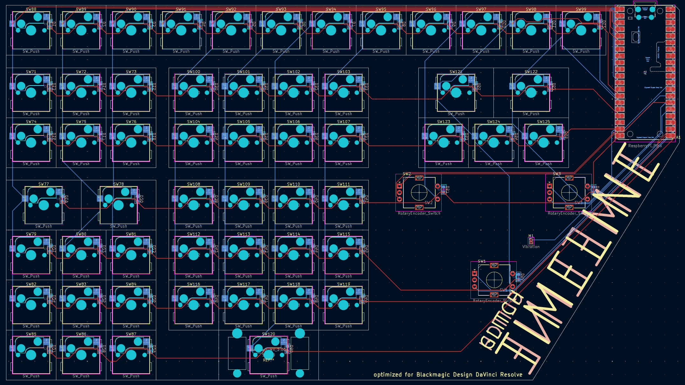

Total hours: 9 

## 7/22: Ideation and planning
I found the DaVinci speed editor, and realized that it would be quite helpful for large-scale video projects, but I did not want to spend $435 on it. I laid out a rough map of the key layout in the schematic editor to see how feasible a clone of it would be, and decided to move forward with this project.

Hours: 2

## 7/23: Putting the schematic together
Exactly what it says on the tin, laid out my matrix and connected it up. I also had the idea to include a small linear vibration motor to add haptic feedback when snapping the knob onto each clip. Combined with a smooth EC11, this will allow for a fast yet precise editing experience.

Hours:2 

## 7/28: PCB and part sourcing
I mapped everything onto the pcb layout, and routed it. I also found which vibration motor to use, and laid out my part sourcing for everything.

Hours: 3

## 7/30: 3d models
I found out that you still need to include component models regardless of whether you're making a case, so I found and imported them. However, I could not figure out a way to retroactively apply them to all of the keyswitches, so I just included 1 as a sample. I'm not concerned about any part interaction, as I'm not making a case for this at this time (maybe later when I have access to a functional 3d printer idek).

Hours: 1

## 7/31: last minute submission

Putting it all together and submitting before the deadline.

Hours: 1
