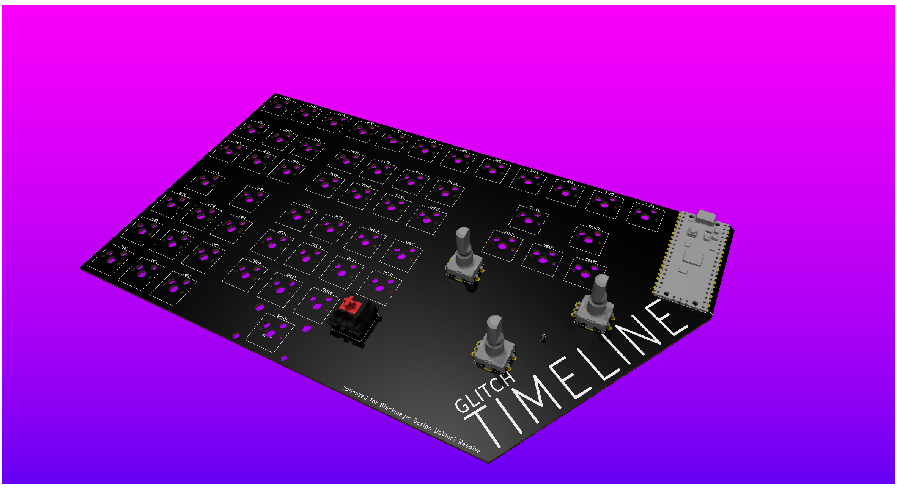

# Timeline
Video/photo editing keyboard tuned for Davinci Resolve

## Why
I edit in Blackmagic Design DaVinci Resolve, and would like to have something a little smoother than a keyboard and mouse. BD sells the Speed Editor, but it costs US$435, which is kinda insane. 

I felt I might as well make my own version of this, so I created this as a largely 1:1 clone of the layout with a custom design

## Assembly/Other info
This does not include a case, as I wanted to keep it low to the table, and to keep the bare PCB aesthetic I enjoy. Solder the parts as they fit into the board, then apply some 3M 2229 to the bottom of the board to resuce sliding, and to protect the board/desk.  

## BOM
|q  |part             |link                                                     |price       |total |
|---|-----------------|---------------------------------------------------------|------------|------|
|1  |pcb              |                                                         |$45.70      |$72.86|
|55 |switches         |                                                         |have on hand|      |
|2  |ECE11 with clicks|https://www.mouser.com/ProductDetail/688-EC11E15204A3    |$7.36       |      |
|1  |Smooth EC11      |https://www.mouser.com/ProductDetail/688-EC11E1834403    |$4.68       |      |
|   |Vibration Motor  |https://www.mouser.com/ProductDetail/665-HD-EM0802-LW30-R|$3.93       |      |
|   |mouser shipping  |                                                         |$7.99       |      |
|   |mouser DDP       |                                                         |$3.20       |      |
